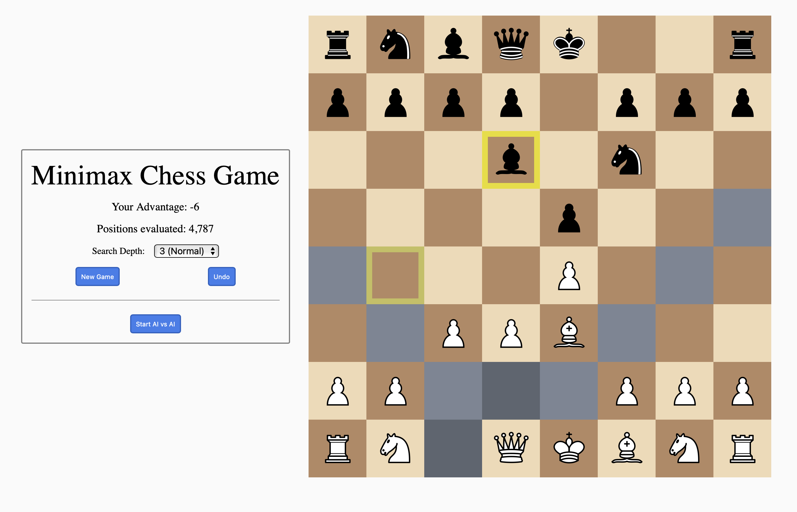

# Mimimax Chess Web Component

This web component provides a playable chess game, including AI capabilities. It follows the [open-wc](https://github.com/open-wc/open-wc) recommendations.

The only dependencies are Lit (a lightweight framework for creating web components), and chess.js which is used for move validation.

A custom minimax algorithm is used to find the best move for the AI. An AI vs AI mode is provided to demonstrate the AI capabilities.
As the minimax algorithm is tree based, the search depth can be controlled, which corresponds to how far down the tree the algorithm searches. The deeper the search, the better the AI's move will be, but the longer it will take to calculate. To prevent the UI freezing during the calculation, a web worker is used to run the algorithm in a separate thread.



## Installation

```bash
npm i minimax-chess-component
```

## Local Demo with `web-dev-server`

```bash
npm run start
```

To run a local development server that serves the demo located in `demo/index.html`

## Rendering component in an HTML file

To use this component in an HTML file, the demo/index.html serves as a good template for this. Lit can be installed via npm or included via a CDN. See the below example:

```html
<body>
  <div id="demo"></div>

  <script type="module">
    import { html, render } from 'lit';
    import 'minimax-chess-component/chess-app.js';

    render(html` <chess-app> </chess-app> `, document.querySelector('#demo'));
  </script>
</body>
```

## Rendering in a React component

To render the component in a React app or component, follow the instructions in [Lit's documentation](https://lit.dev/docs/components/react/). The following is a simple example of how to do this:

```jsx
import 'minimax-chess-component';
import { ChessApp } from 'minimax-chess-component/chess-app.js';
import { createComponent } from '@lit/react';
import styles from './minimax.module.scss';
import React from 'react';

const ChessComponent = createComponent({
  tagName: 'chess-app',
  elementClass: ChessApp,
  react: React,
});

export default function ReactChessApp() {
  return (
    <div className={styles.minimaxChessContainer}>
      <ChessComponent />
    </div>
  );
}
```

## Rendering in other frameworks

As web components are framework agnostic, they are able to be used in most frameworks. Follow your framework's documentation for how to render web components.
